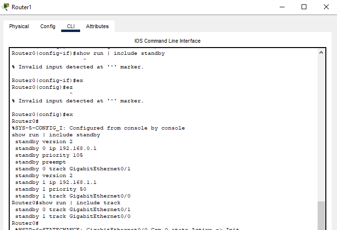
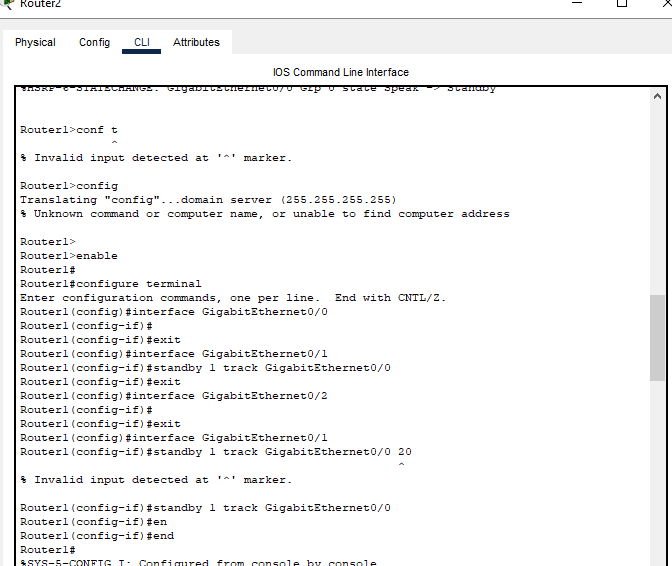
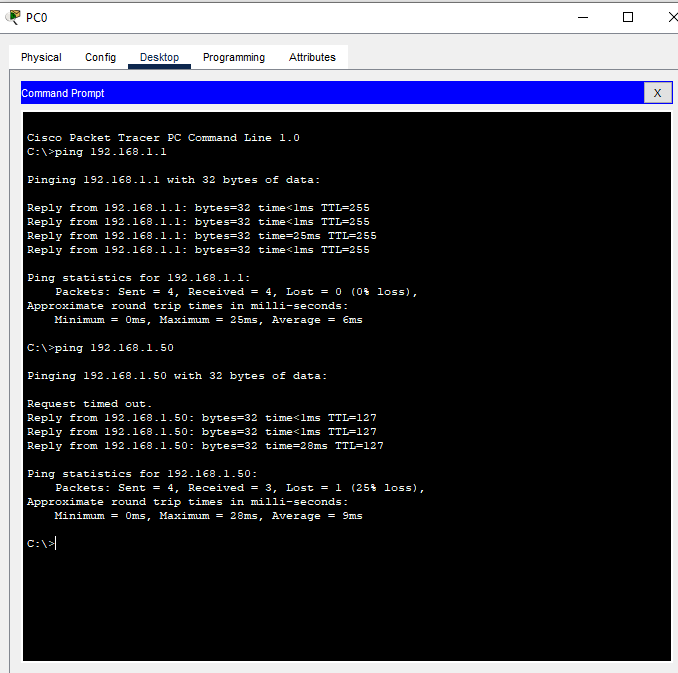
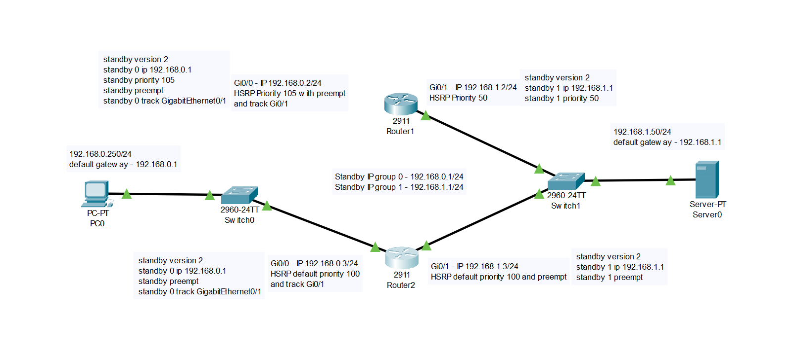

1# Disaster_recovery_Keepalived_homework_01. GitLab Runner

**Кolesnikov Aleksandr**  

## Задание 1

### Скриншот настройки роутера 1

### Скриншот настройки роутера 2

### Скриншот ping

### Скриншот схемы

## Задание 2
