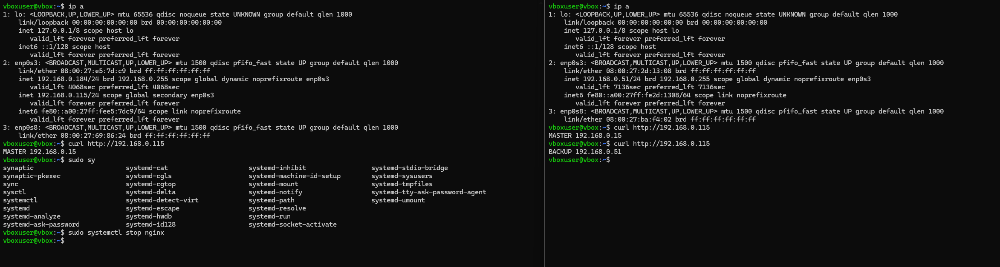

1# Disaster_recovery_Keepalived_homework_01. GitLab Runner

**Кolesnikov Aleksandr**  

## Задание 1

### Скриншот настройки роутера 1


### Скриншот настройки роутера 2


### Скриншот ping


### Скриншот схемы


## Задание 2

### Скрипт
```Bash
sudo cat /etc/keepalived/check_web.sh
#!/usr/bin/env bash
set -u
set -o pipefail

PORT=80
HOST="127.0.0.1"
INDEX="/usr/share/nginx/html/index.html"
URL="http://${HOST}:${PORT}/"

# 1) Проверка: порт слушается
if ! ss -lnt "( sport = :${PORT} )" | grep -q LISTEN; then
    exit 1
fi

# 2) Проверка: index.html существует и не пустой
if [[ ! -s "$INDEX" ]]; then
    exit 2
fi

# 3) Проверка: nginx отвечает по HTTP
if ! curl -fsS --max-time 1 "$URL" > /dev/null; then
    exit 3
fi

exit 0
```

### Конфиг keepalived

``` Bash

sudo cat /etc/keepalived/keepalived.conf
vrrp_track_process check_nginx {
       process "nginx"
}
vrrp_instance VI_1 {
        state MASTER
        interface enp0s3
        virtual_router_id 15
        priority 255
        advert_int 1


        virtual_ipaddress {
              192.168.0.115/24
        }


        track_process {
                   check_nginx

                }
}


sudo cat /etc/keepalived/keepalived.conf
vrrp_track_process check_nginx {
       process "nginx"
}
vrrp_instance VI_1 {
        state BACKUP
        interface enp0s3
        virtual_router_id 15
        priority 254
        advert_int 1


        virtual_ipaddress {
              192.168.0.115/24
        }


        track_process {
                   check_nginx

                }
}
```

### Скриншот демонстрации отказаустойчивости

